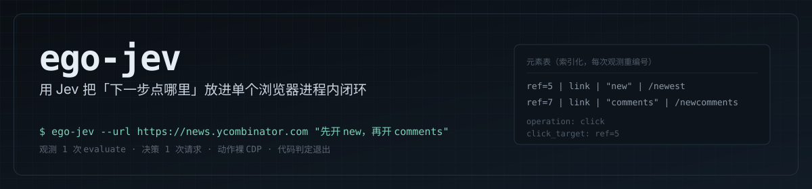
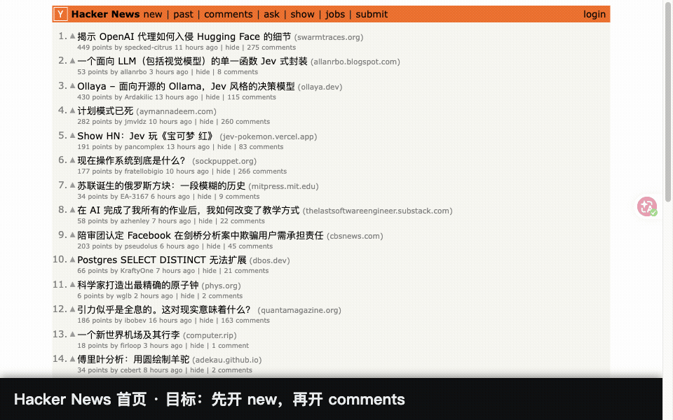

[](https://skills.sh/jiangkoumo/ego-jev)

**用 Jev（TypeSafe System One）驱动 ego lite 浏览器：把「下一步点哪里」的决策放进单个进程内闭环。**

> **为什么是这一个**：差异只有一条 —— **它是被测量的**。本机 2026-09-26 全量复跑 **16 套测试 / 429 项检查**
> （除 `native-select` 是成功率测量外全部 exit 0）；原始数据在 [`bench/raw/`](bench/raw)，每个数字都能用仓库里的
> 脚本复算；[`CHANGELOG.md`](CHANGELOG.md) 里记着**被实测推翻的旧结论**（包括我们自己先前公布的口径错误）；
> 执行层是 **fail-closed**（陈旧 ref、被遮挡、跨 frame 命中失败、危险动作一律 **0 次派发**）；
> 代码级溯源登记在 [`THIRD-PARTY.md`](THIRD-PARTY.md)。

> English summary: `ego-jev` replaces the per-step LLM round trip in browser automation with
> [TypeSafe](https://docs.typesafe.ai)'s System One model **Jev**. Jev reads one *indexed element
> table* and answers, in a single request, both the **operation** (`click` / `type_text` / `select` /
> `scroll_up` / `scroll_down` / `wait` / `done` / `blocked`) and the **target element**. Code owns
> observation, execution, verification and exit conditions.
>
> Measured after the engine rebuild: HN two-step navigation **4569ms → 1916ms** on the same task, and
> against browser-harness + jev-ultrafast over 100 pre-registered paired rounds — click chain
> **−378ms**, wiki search **−819ms** (using 1 Jev decision instead of 3), form filling **no
> difference**, native select **+248ms** in their favour. Raw data in
> [`bench/raw/`](bench/raw) via [VERIFY-REPORT.md](VERIFY-REPORT.md).

---

## 为什么需要它

用 `ego-browser` 做多步任务时，典型写法是每一步都退出浏览器上下文、回到大模型问一句「下一步点哪里」，
拿到答案再开一步。贵在三处：

- **模型往返**：一次大模型判断实测 1.6–4.5s（`kimi-k3` 1.8s、`minimax-m3` 1.6s、`glm-5.3` 3.2s、
  `qwen3.8-max` 3.5s、`deepseek-v4-pro` 4.5s），每一步都要付一次。
- **上下文开销**：每步一个新进程 / 新会话，进程启动本身 250–350ms，还要重新把页面状态讲一遍。
- **不确定性**：退出条件写在模型嘴里，判没判对没法核对。

`ego-jev` 把「下一步做什么、点哪个」换成一个小模型 **Jev**，一次请求就答完；观测、执行、
陈旧校验、退出条件全部由代码负责。它**不替代大模型**：Jev 不生成文本、不做业务判断，
需要写内容时再调一个小文本模型。

## 能做什么

每条都带一个实测数字或明确边界；数字的测量条件见[测量与复跑基准](#测量与复跑基准)。

- **多步线性任务一条命令闭环**：连续点击、翻页、搜索表单提交、导航跳转。Hacker News 两步导航
  A/B 对照中位 **4.9s**（1 进程）对经典循环 **9.7s**（3 进程）。
- **决策比大模型快**：Jev 决策请求 **0.35–0.52s/次**（10 次采样，中位 434ms），大模型 1.6–4.5s/次。
- **观测便宜**：一次 `page.evaluate` 自建元素表，**2–4ms / ~2k 字符**；旧路径 `page.snapshot()`
  是 110–130ms / 27484 字符。
- **动作便宜**：裸 CDP 派发 **13–16ms**；旧路径 `page.click(ref)` 788–1005ms。
- **元素表覆盖原生控件之外**：无 role 的容器型可点元素（`<div onclick>`、`tabindex`、
  `cursor:pointer` 块级容器）补成 `clickable-region`；实测 YouTube 首页 3 个、X 首页 5 个，
  真实 Jev 能选中它。同源 iframe 与开放 shadow root 里的元素也进表。
- **执行期护栏**：陈旧 ref、被遮挡、不可用、跨 frame 命中失败一律拒绝执行（0 次派发），
  另有**危险动作前置拦截**——目标命中「支付 / 删除 / 退订」词表（我们自己的中英词表）时不执行。
- **退出条件由代码判定**：`--until <substr>` 或脚本里的 `check`，不依赖模型自评。
- **每一步可核对**：分阶段耗时（观测 / 决策 / 执行 / 校验）与**服务端实际模型版本**由
  `renderJevSummary` 打印；请求里写的是浮动别名，只有响应里的 `model` 字段能说明当时服务的是哪版。
- **凭证链 + 后端可降级**：凭证按文件链查找（含已有 rc 里的 `export`），后端地址可覆盖，
  主后端失败有一条可关闭的降级端点。
- **没凭证也能先自测**：`bench/test-offline-e2e.mjs` 在 `about:blank` 上注入 DOM，
  用注入判定器跑真实的观测 → 裸 CDP 派发 → 真实 DOM 断言，不联网、不需要 key。

## Demo



上面这段是**真实运行**录的：`docs/capture-demo.mjs` 跑 hacker news 首页 → `new` → `comments`，
每步动作后注入的说明条取自真实的 `runJevStep` 结果（不是写死「成功」）。重做命令见
[`docs/README.md`](docs/README.md)。

## 安装

### 方式 1：skills CLI（推荐，一行）

```bash
npx skills add jiangkoumo/ego-jev
```

装完技能落在 Agent 的技能目录里（如 `~/.agents/skills/ego-jev/`），引擎和 CLI 一起带过去。

### 方式 2：Claude Code 插件市场

仓库根有 `.claude-plugin/plugin.json` 与 `.claude-plugin/marketplace.json`，技能本体在
`skills/ego-jev/`（里面是**指向仓库根**的相对软链，不复制正文）。在 Claude Code 里：

```
/plugin marketplace add jiangkoumo/ego-jev
/plugin install ego-jev@ego-jev
```

### 方式 3：克隆后跑安装脚本

```bash
git clone https://github.com/jiangkoumo/ego-jev.git
cd ego-jev
./install.sh            # 链接 CLI 进 ~/.local/bin、准备凭证，并**默认接管**官方 ego-browser 入口
./install.sh --no-wire  # 只装 CLI，不接管（旧行为）
./install.sh --test     # 顺带跑一次端到端冒烟测试
```

### 让 Agent 默认走 ego-jev（默认接管）

ego lite 会把**官方** `ego-browser` 技能写进每个 Agent 的技能目录
（`~/.agents/skills/ego-browser`、`~/.claude/skills/ego-browser` …，由 App 在安装/升级时重建），
而官方正文不知道 ego-jev 存在——不管的话，Agent 默认照它写逐步脚本，ego-jev 根本不会被启动。

`scripts/wire-agent-skills.sh` 把这个入口接管成一层**路由层**（包外）：Agent 先看到的
「先路由、再决定写不写脚本」那一节是本技能加的，技能正文仍然软链到 App 的当前版本（升级自动跟随）。
技能列表里的 description 也把**路由句排到厂商描述之前**（描述被按预算压缩、优先丢尾部，排在末尾
等于最先被砍掉）；厂商文本一字不改，只是挪到后面。
**`install.sh` 默认就会做这件事**，`ego-jev` CLI 首次运行时也会在检测到官方入口时补一次：

```bash
bash scripts/wire-agent-skills.sh              # 接管 / 刷新（幂等；只写 Agent 技能目录，不碰应用包）
bash scripts/wire-agent-skills.sh --check      # 只读检查：已接管 N / 无需接管 M / 漂移 K（漂移则 exit 1）
bash scripts/wire-agent-skills.sh --restore    # 还原成官方软链 + 记下「不接管」（粘性，见下）
```

退出码：`0` 正常 / `1` 需要处理（`--check` 发现漂移；或本次一个都没接管到）/ `2` 用法或环境错误。
`--vendor`（或 `EGO_JEV_VENDOR`）显式指定时就是权威：目录里没有 `SKILL.md` 直接报错，不回退自动探测。
`--check` 对每个目录给出结论（本机实测）：

```
OK    ~/.agents/skills/ego-browser（路由层，生成物最新）
OK    ~/.claude/skills/ego-browser（路由层，生成物最新）
无需接管  ~/.codex/skills（没有官方 ego-browser 入口；该 Agent 通过自身的 ego-jev 技能被发现）

==> 路由: 已接管 2 / 无需接管 3 / 漂移 0
```

`--check` 是**只读**的（不写启用标记、不改 mtime）；`--restore` 不需要 ego lite 还在（不会自锁）。
接管会在 `~/.config/ego-jev/wire-enabled.json` 留下启用标记；`./update.sh` 与 `ego-jev` CLI
都会据此自动重接管（`EGO_JEV_NO_WIRE=1`，旧名 `EGO_JEV_NO_HEAL=1` 仍接受）。
路由只影响**新开的** Agent 会话（技能列表是启动时快照的）。

**`--restore` 是粘性的**：它会记下「用户已明确选择不接管」（`~/.config/ego-jev/opted-out`），
之后 CLI 首跑**不会**再把入口接管回去（`--ensure` 见到该标记就什么都不做）；`--check` 在该状态下
输出「已按用户选择不接管」并 **exit 0**（健康状态，不是漂移）。重新启用必须**显式**跑一次接管
（上面的 `bash scripts/wire-agent-skills.sh`，或 `./install.sh` 的接管步骤）——
自动路径（`--ensure` / `--if-enabled`）永远不会解除这个选择。

### 让 Agent 在读任何技能之前就看到路由（always-on，显式开关）

接管只覆盖「Agent 去读 `ego-browser` 技能」这条路径。若想让它**在读技能之前**就知道
「多步线性浏览器任务先走 ego-jev」，可以把一段带标记的说明块写进常驻指令文件：

```bash
bash scripts/wire-agent-skills.sh --always-on AGENTS.md              # 项目级：只覆盖这个仓库，随仓库共享（最安全）
bash scripts/wire-agent-skills.sh --always-on ~/.claude/CLAUDE.md    # 本机所有 Claude Code 项目
```

块用 `<!-- ego-jev:route begin -->` / `<!-- ego-jev:route end -->` 标记，**幂等**（重复跑只替换自己那一块），
首次写入前备份到同目录 `.bak`，`--restore` 会把它连同接管层一起精确移除（块外内容一字不动）。
**默认不会写任何用户文件**——只有你显式传 `--always-on <file>` 才写。

三种放法各覆盖谁：

| 放法 | 覆盖范围 |
| --- | --- |
| 项目 `AGENTS.md` | 只覆盖该仓库（开放标准，Codex / Cursor / Amp / Copilot 等都会读），随仓库共享 |
| `~/.claude/CLAUDE.md` | 本机所有 Claude Code 项目（常驻指令文件） |
| 个人作用域技能（`~/.agents/skills`、`~/.claude/skills`） | 该 Agent 的技能列表；**在 Cowork / 云会话里不加载**，always-on 那行也一样受会话类型限制 |

### 路由可审计：`--route-status`

```bash
ego-jev --route-status        # 只读 JSON：接管情况 / always-on / 官方技能路径 / 生成物哈希
```

不起浏览器、不需要凭证、不建 TaskSpace。同一份信息也会作为 `route` 段写进每次任务的结果 JSON，
`renderJevSummary` 收尾还会带一行：`路由: 已接管 2 / 无需 1 / 漂移 0 · always-on 1`。

### 方式 4：把这段 prompt 丢给你的 Agent

> 帮我安装 https://github.com/jiangkoumo/ego-jev ：
> 1. 执行 `npx skills add jiangkoumo/ego-jev`（skills CLI 不可用就改成克隆仓库跑 `./install.sh`）；
> 2. 确认 `ego-browser --version` 正常，没有 ego lite 就先让我装；
> 3. 确认 `~/.config/typesafe/api_key` 存在且权限 600，缺了就问我要 Key——**不要自己编，也不要回显它**；
> 4. 跑下面「验证安装」里的命令，把真实输出和退出码报给我；
> 5. 接管官方 ego-browser 入口（让多步任务默认走 ego-jev）：`bash scripts/wire-agent-skills.sh`，
>    再用 `--check` 确认 exit 0。**只写 Agent 技能目录，不要改 `/Applications/ego lite.app` 里的任何文件。**

### 更新

```bash
cd ego-jev && ./update.sh          # 克隆安装：拉取 + 刷新软链 + 打印版本（幂等，可反复跑）
./update.sh --test                 # 顺带跑一次端到端冒烟
npx skills add jiangkoumo/ego-jev  # skills CLI 安装的：重跑一次即覆盖更新
```

`update.sh` 会自动判断你属于哪种安装方式：git 克隆就 `git pull --ff-only`（软链自动跟随，无需重装）；
skills CLI 装的是拷贝、会提示你重跑那条 `npx skills add`。**工作区有未提交改动时会跳过 pull**，
不会覆盖你的改动。

## 验证安装（别只看代码，跑起来）

```bash
ego-browser --version                                        # 前置条件
"<技能目录>/scripts/ego-jev" \
  --url "https://en.wikipedia.org/wiki/Main_Page" \
  --text "Jev" --until "/wiki/Jev" --steps 5 \
  "在搜索框输入 Jev 并提交"
# 期望：exit 0，且输出里 "success": true

# 接管过官方入口的话（默认就会接管），看它是否还生效：
bash "<技能目录>/scripts/wire-agent-skills.sh" --check   # 期望：exit 0（漂移则 exit 1）
grep -l "先路由" ~/.agents/skills/ego-browser/SKILL.md     # 期望：打印出路径
```

**没凭证也能先自测**：`ego-browser nodejs < bench/test-offline-e2e.mjs` 在 `about:blank` 上注入 DOM，
用 `options.ask` 注入确定性判定器（不联网、不需要 key），但观测、`locate`、裸 CDP 派发、结果断言
全走真实路径；失败时能分清是引擎坏了还是凭证/网络问题。

### 凭证：必须落盘成文件

> **这是最容易踩的坑**：`ego-browser nodejs` 内嵌运行时只继承最小化登录环境（`HOME`/`PATH` 等），
> 父进程 `export` 的环境变量（含 `TYPESAFE_API_KEY`）**不会传进去**。所以凭证必须写成文件。

```bash
mkdir -p ~/.config/typesafe && printf '%s\n' 'YOUR_TYPESAFE_API_KEY' > ~/.config/typesafe/api_key
chmod 600 ~/.config/typesafe/api_key
```

从 [TypeSafe](https://docs.typesafe.ai) 获取 API Key。也可用 `TYPESAFE_API_KEY_FILE` 指定别的路径，
或 `--api-key` 直接传入。

查找顺序（全部是文件，因为 ego 运行时拿不到父进程环境变量）：
`--api-key` > `TYPESAFE_API_KEY`（仅普通 node 进程可见）> `TYPESAFE_API_KEY_FILE` >
`~/.config/ego-jev/credentials` > `~/.config/typesafe/api_key` >
`~/.zshrc` / `~/.bashrc` / `~/.bash_profile` / `~/.profile` 里的 `export TYPESAFE_API_KEY=…`。
所以已经 export 过 key 的机器不必再落盘一次。后端地址可用 `TYPESAFE_BASE_URL` 覆盖，
主后端失败时的降级端点用 `TYPESAFE_FALLBACK_BASE_URL`（不设即不降级，`fallback: false` 可关）——
**CLI 会在父进程读这两个变量并写进配置传给子进程**（ego 运行时自身读不到自定义环境变量）；
直接写 `ego-browser nodejs` 脚本时请改用 `options.baseUrl` / `options.fallbackBaseUrl`。

## 用法

命令行：

```bash
# 简单目标
ego-jev --url "https://example.com" "点击登录按钮并聚焦输入框"

# 推荐：给确定性成功条件（URL 包含该子串即判成功）
ego-jev --url "https://news.ycombinator.com" --until "/newcomments" \
  "先打开 new 页面，再打开 comments 页面"

# 需要输入文本：候选由调用方给，Jev 只选字段和选哪段文本
ego-jev --url "https://en.wikipedia.org/wiki/Main_Page" --text "Jev" \
  --until "/wiki/Jev" "在顶部搜索框输入 Jev 并提交"

# 复用已有 taskSpace，完成后保留供人工检查
ego-jev --space 3 --keep-space --steps 15 "点击未发送帖子并保存"
```

`--until` 给的是**确定性**退出条件，比依赖 Jev 自评 `done` 可靠得多，强烈建议带上。
退出码：`0` 达成 / `1` 未达成（此时 taskSpace 被保留供排查）/ `2` 参数错误 / `3` 缺凭证。
CLI 收尾会打印一行分阶段耗时与**服务端实际模型版本**（`renderJevSummary`）。

在 `ego-browser nodejs` 脚本里复用引擎：

```js
import { runJevAutonomousLoop } from "/path/to/ego-jev/ego-jev.mjs";

const result = await runJevAutonomousLoop(page, "先打开 new 页面，再打开 comments 页面", {
  maxSteps: 8,
  text: ["Jev"],                                                  // 可填文本候选（可选）
  check: async (p) => (await p.url()).includes("/newcomments"),    // 确定性成功条件（推荐）
});
console.log(result); // { success, reason, steps, history, phases, serverModels, usage }
```

配套导出：`askJev`、`runJevStep`、`parseActionTargets`、`enrichTargets`、`buildQuestions`、
`validateChoice`、`generateText`、`loadTextModelConfig`、`resolveTextApiKey`、`loadApiKey`、
`renderJevSummary`（分阶段耗时 + 服务端模型）。判定器可注入：`options.ask(state, questions)`，
与 `askJev` 同签名，用于离线自测或接入别的判定器。

把「自动驾驶」作为**独立技能**装给 Agent（可选）：

```bash
npx skills add jiangkoumo/ego-jev          # 推荐
# 或本地链接：
mkdir -p ~/.agents/skills/ego-jev && ln -sfn "$PWD/SKILL.md" ~/.agents/skills/ego-jev/SKILL.md
```

> **不要**把 Jev 章节加进 ego lite 应用包里的 `SKILL.md`。那是供应商受签名的应用包，
> 升级会替换 `Resources/ego-skills/` 目录（版本号目录都会换），改动必然丢失。
> 本技能刻意放在包外，升级后无需重做。

## 文本生成（可选）

`--text` 的候选文本由调用方给出时，Jev 只做选择。若想让模型自己写文本（例如「搜索哥德尔不完备定理」
需要生成搜索词），配置一个 OpenAI 兼容端点：

```json
// ~/.config/typesafe/text_model.json
{
  "baseUrl": "https://your-endpoint/v1",
  "apiKeyJson": { "file": "~/.pi/agent/auth.json", "path": "opencode-go.key" },
  "model": "deepseek-v4.1-flash",
  "sessionHeader": "x-opencode-session",
  "sessionId": "ego-jev",
  "userAgent": "ego-jev/1.0"
}
```

- `apiKeyJson` **引用已有凭证文件**而不复制密钥；也可直接写 `apiKey`
- 生成结果**严格校验**：只接受恰好一个非空 `text` 字段的 JSON，不合格判 `text_model_failed` 而**不猜值**
- 也可在脚本里把 `textModel` 传成自定义 `async (input) => string` 函数接入任意模型
- `textModel: null` 显式禁用
- 实测某网关的 `deepseek-v4.1-flash` 会输出 `reasoning_content`，`reasoning:{enabled:false}` 无效，
  生成约 1.3–1.9s

## 退出原因

| reason | 含义 |
| --- | --- |
| `check_passed` / `jev_done` | 成功 |
| `blocked` | Jev 判定验证码/登录墙/无可用推进手段 |
| `no_progress` | 连续 5 次变更类动作页面无变化 |
| `stuck` | 同一动作连续 3 次无变化（含反复滚动；原生下拉重问仍失败也归这里） |
| `target_missing` | 选了需要目标的动作却没解析出目标（连续 2 次） |
| `no_targets` | 连续 3 次空快照（页面可能仍在加载） |
| `guard_rejected` | 执行前守卫拒绝（陈旧/遮挡/不可用/跨 frame 命中失败，或命中危险动作词表 `dangerous_action`），该步未执行 |
| `invalid_response` | Jev 响应校验不通过（非 argmax 或概率和不一致），未执行 |
| `text_model_failed` / `no_text_source` | 输入操作拿不到文本，**不会猜一个值填进去** |
| `action_failed` / `max_steps_reached` | 执行异常 / 超出步数预算 |

失败时先看 `reason` 再决定是否重试；不要盲目重跑同一目标。

## 已知限制（实测）

- **「装完就默认走 ego-jev」能到哪一步**（这些是别人踩过的坑，不是我们的猜测）：
  - 个人作用域的同名技能可以**替换内置命令，但替换不了它的别名**——别名仍指向内置版本。
  - 个人作用域技能**在 Cowork / 云会话里不加载**（会话类型限制，不是配置问题）；always-on 那行也一样。
  - 插件作用域技能是**命名空间**的（`插件名:技能名`），所以插件渠道天然**不会**覆盖内置技能。
  - 想「让冲突源消失」可以用官方的 `disable-model-invocation: true`（把某技能整个移出上下文）
    或 `Skill(name)` 权限 deny 规则；**我们只文档说明，不自动改用户设置**。
  - hooks（`SessionStart` / `UserPromptSubmit` 注入 `additionalContext`）是唯一「必须发生」的强制层；
    **本轮没做**——它要写用户的 Agent settings，代价是侵入用户配置。
- **路由触发率：已分层量化，但样本很小（决策探针，不是执行成功率）**——方法：起全新会话（中立 cwd，
  不读本仓库），给真实口吻的多步浏览器任务，只让它报「打算怎么做」、不许执行；判定「计划里是否走 ego-jev」。
  - **交互式会话：5/5 主动走 ego-jev**（当时只有同名接管 + 自身技能两层，**没开 always-on**；
    含两条不含「点击/翻页」字眼的问法）。开启 always-on 后复测 2/2，无回归。
  - **子代理 / 一次性无会话上下文：0/6**（开 always-on 之前是 0/4）。探针确认这类上下文里
    **既没有技能清单、也没有任何 AGENTS.md 内容**——always-on 那行到不了它们。所以把浏览器活
    派给子代理时，**必须在 handoff 里显式写「用 `ego-jev` CLI」**，否则它不会自己选。
  - 注意事项：`n=5/6`、单机单模型、探针只报计划；这不能外推成「真实执行成功率」。
- **跨域 iframe 不处理**：读不到 `contentDocument`，这类树不在观测范围内。
- **frame 祖先带缩放/旋转时直接拒绝**：frame 内坐标换算会失真，所以宁可不点。
  frame 元素到文档根的祖先链上有非 identity 的 2D 线性变换（scale/rotate/skew）或 `zoom !== 1`
  时记 `frame_transformed`；纯平移、`translateZ(0)` 这类只影响合成的写法放行。
  跨 frame 命中测试逐层做：每层 `elementFromPoint` 必须**严格命中承载下一层的 `<iframe>` 自身**，
  任一层被遮挡即 `covered`、0 次派发；frame 链断记 `frame_unresolved`。这是有意的 fail-closed 取舍。
- **危险动作词表是启发式**：命中「支付/删除/退订」一类目标时不执行并直接停（`dangerous_action`），
  但词表是我们自己拟的中英词表，`remove` / `pay` 这类词可能误伤，站点改版后可能要调；
  `dangerGuard: false` 可整体关闭。
- **降级路径默认关闭，且没有真实第二后端验证**：`TYPESAFE_FALLBACK_BASE_URL` 不设就不降级，
  机制只用假端点验证过。
- **真实验证码/登录墙未测**（只在合成拦截页上验证过 `blocked` 分支）。
- **旧的「维基语言选择器 2/3」基线元素已变**：`www.wikipedia.org` 的 77 项 `#searchLanguage`
  现在是 `opacity:0`（被自定义语言列表 UI 取代），引擎按可见性规则跳过它。同类任务在 DDG 设置页
  语言下拉实测 **6/6**（`bench/test-native-select.mjs`）。
- **原生下拉的「选中项不在当前 options 里」有了一次重问**：选项在观测与执行之间被 JS 重建/重排时，
  不再当失败/无进展，而是**一次**带新选项的重问（`maxOptionRetries` 默认 1），重问仍失败才报 `stuck`。
- **默认的自建 DOM 元素表覆盖自定义控件，旧快照路径不覆盖**：实测 DuckDuckGo 设置页 DOM 有
  18 个复选框，默认 `observe: "dom"` 路径下 18 个全部进元素表（视口内 5 个；拉高视口后 18 个）；
  `observe: "snapshot"` 路径仍是 0 个（1×1 的自定义样式 input 不进辅助树）。
  部分站点的复选框在快照里既无定位器也无名称，只能按**文档顺序**兜底补齐；
  仅当数量完全一致时才敢用，否则显示「勾选态未知」而不会谎报。
- **浏览器自动翻译会影响判断**：实测页面被译成中文后，元素名与选项名与目标语言不一致。
  Jev 跨语言选择正常，但 `--until` / `check` 用 UI 字符串比较会误判——请比对 URL 路径或 DOM 状态。
- **ego 运行时会静默吞掉两件事**（排查时很坑）：
  静态 `import ... from "node:http"` 会让整个脚本无输出、exit 0（必须用 `await import()`）；
  运行时不能起服务也不能访问 loopback（`fetch("http://127.0.0.1:...")` 会挂起后 exit 0）。
- **运行时拿不到自定义环境变量，且 `process.cwd()` 是 `/`**：`export FOO=bar` 在脚本里读不到，
  相对路径也不能用。要传配置只能在父进程把值替换进脚本文本（本项目的 CLI 就是这么做的）。
- Jev 走完**不等于业务正确**，最终页面状态仍要按 ego-browser skill 的观察纪律复核。

## 测量与复跑基准

> 所有数字都来自本机真实运行（macOS + ego lite 0.5.0.32）。请求里写的是浮动别名
> `jev-latest`，**服务端实际服务哪个版本只有响应里的 `model` 字段能回答**——每次测量都要记下它
> （`renderJevSummary` 会打印）。2026-09-26 曾出现约 5 分钟 `403 RBAC: access denied`
> （凭证文件完好、随后自愈）：环境本身会变，只记「能跑通」不够。

**方法**：同任务、同元素表、同验证器，「交替 3 轮取中位数」。
A = `ego-jev` 单进程闭环；B = 经典循环（**每步一个独立进程** + 大模型 `kimi-k3` 思考）。
测于 2026-09-19。

| 任务 | A（ego-jev） | B（经典循环） | 结果 |
| --- | ---: | ---: | --- |
| Hacker News 两步复合导航 | 中位 **4.9s**（1 进程，12 次浏览器调用） | 中位 **9.7s**（3 进程） | **约 2.0×** |
| 维基百科搜索（两组都要生成文本） | 中位 **5.4s**（1 步） | 中位 **10.1s**（2 进程） | **约 1.9×** |

样本只有 3 对/任务且**方差很大**（经典组单轮 7.3s–22s，上表是不同批次里更好的那批），不构成基准；
只能说量级上 Jev 闭环约为经典循环的一半时间。

**省在哪里（实测分解）**：

- ✅ **决策往返**：Jev 决策请求约 **0.35–0.52s/次**（2026-09-26 实测，服务端 `jev-1.13.0`，
  10 次采样 352–524ms、中位 434ms），可用大模型 1.6–4.5s/次。整步（观测+决策+执行+校验）约 1.0–1.4s。
- ✅ **每步退出浏览器上下文**：B 每步一个新进程，A 全程 1 个（进程启动实测仅 250–350ms/次，不是主要成本）
- ✅ **省浏览器动作**（引擎重建后新增，现在是最大收益项）：观测是一次 `page.evaluate`
  自建 DOM 元素表（约 **2–4ms / ~2k 字符**），动作走**裸 CDP**（**13–16ms**）；
  旧路径是 `page.snapshot()` **110–130ms / 27484 字符**、`page.click(ref)` **788–1005ms**

> 分阶段数据显示当前单步的大头是「派发 + 稳定等待」0.56–0.99s，而不是决策（0.35–0.52s）。
> 目标能用选择器写死时，直接写代码比两者都快。

### 引擎重建后（2026-09-22）

按剖析结果重建，不是按猜测——真实瓶颈是 **ego 的语义动作通道**，不是快照。
同任务隔离实验（5 臂 × 3 任务 × 3 次，全部 3/3 成功）：

| 任务 | 重建前 | 重建后 |
| --- | ---: | ---: |
| Hacker News 两步导航 | 4569ms | **1916ms** |
| httpbin 表单（填写+勾选+提交） | 6782ms | **3607ms** |
| 维基搜索（含文本生成） | 3663ms | 3634ms（受模型延迟主导，无变化） |

> HN 那一行是 A4 臂（含响应校验/提示词规则/执行前守卫）；只加「自建元素表 + 裸 CDP 动作」的 A3 臂
> 是 **1675ms**。两档都记在 [`PORT-REPORT.md`](PORT-REPORT.md)，原始数据在 [`bench/raw/`](bench/raw)。

**与 browser-harness + jev-ultrafast 的预登记配对验证**（5 任务 × 2 栈 × 10 轮 = 100 轮，
bootstrap 95% CI，判定规则**跑前写死**）：

| 任务 | 结论 |
| --- | --- |
| HN 点击链 | **本体更快 −378ms**，CI[−1453,−313]，10/0 |
| 维基搜索 | **本体更快 −819ms**，CI[−1314,−195]；且只需 **1 次 Jev 决策**（对方 3 次）|
| 表单填写 | **无差异**（CI 跨 0）|
| 原生下拉 | 对方更快 **+248ms**，CI[163,426] |
| 翻页（目标在文档序 110/119）| 两栈都完不成 —— 能力边界，非速度问题 |

另外：**滚动若真的移动了视口或露出新元素就算进展** —— X 上必须连滚 >3 次的深帖任务 **0/6 → 6/6**。
详见 [`VERIFY-REPORT.md`](VERIFY-REPORT.md)，每个数字都能追到 [`bench/raw/`](bench/raw)。

### 复跑

```bash
cd examples/bench
# 编辑 task.json（目标/URL/验证子串），然后：
./run-pair.sh A                 # ego-jev 单进程闭环
./run-pair.sh B kimi-k3         # 经典循环：每步一个进程 + 大模型
```

基准脚本需要 OpenCode Go（或任何 OpenAI 兼容网关）的凭证，路径写在脚本里，按需修改。

历史 A/B 对照的报告（`VERIFY-REPORT.md`、`PORT-REPORT.md`、`REVEAL-REPORT.md`、`BH-PORT-REPORT.md`）里，
**B 臂**是 `browser-harness + jev-ultrafast`。它的引擎已经移植进 `scripts/ego-jev.mjs`，宿主 `bh` 也已移除，
所以**驱动脚本已撤出仓库**（在 git 历史里，如 `git show 599a49b:bench/run-b.py`）。
已发布的 B 栈数字仍可复算：原始数据在 `bench/raw/`，`bench/analyze-*.mjs` 会从它重算表格。

现在只剩 A 臂，编排脚本与它自带的预检：

```bash
bash bench/verify.sh --check-env        # 预检（0 = ego-browser 就绪）
bash bench/verify.sh 10                 # 5 任务 × 10 轮，结果落 bench/raw/
--a-only                               # 旧命令，仍接受（现在只有 A 臂）
BENCH_OUT_DIR=/tmp/x bash bench/verify.sh 1   # 或写到别处，不污染仓库
```

## 仓库结构

```
SKILL.md                 技能本体（刻意放在根目录——`npx skills add` 就是找它；也是版本号唯一来源）
CHANGELOG.md             版本历史（顶部条目必须与 SKILL.md 的 metadata.version 一致）
AGENTS.md                给其他 Agent 的安装/验证指令（可直接粘贴的 prompt 在里面）
scripts/ego-jev.mjs      引擎
scripts/ego-jev          CLI（自动在 同目录 / 仓库根 / ~/.agents/lib 里找引擎）
scripts/wire-agent-skills.sh   接管/刷新官方 ego-browser 入口；--check / --restore / --ensure / --status-json / --always-on
overlay/ego-browser/     路由层的模板（接管时渲染到 Agent 技能目录）
.claude-plugin/          Claude Code 插件元数据（plugin.json / marketplace.json）
skills/ego-jev/          插件技能目录（SKILL.md / scripts / overlay 都指向仓库根的软链）
docs/                    demo 素材与重做脚本（banner.svg / demo.gif / capture-demo.mjs …）
examples/bench/          A/B 对照基准脚本（CLI 闭环 vs 每步大模型）
bench/verify.sh          A 臂验证编排（--check-env 预检；结果落 bench/raw/ 或 BENCH_OUT_DIR）
bench/test-*.mjs         离线/在线测试（含 test-release-consistency.mjs、test-no-bh-dependency.mjs）
install.sh               手工安装（接 CLI 进 PATH、准备凭证；**默认接管入口**，--no-wire 跳过）
update.sh                一键更新（幂等；自动识别克隆/拷贝两种安装方式，并重接管入口）
```

## 致谢

- [citrolabs/ego-lite](https://github.com/citrolabs/ego-lite)（MIT）—— 本项目的运行基础。
  根目录的 `SKILL.md` 是本项目自带的**附加技能**，装在应用包之外，不是对它的文档做的修改
- [browser-use/jev-ultrafast](https://github.com/browser-use/jev-ultrafast)（MIT, Copyright (c) 2026 Browser Use）
  —— 本项目的**响应校验、动作执行器、观测层元素表、提示词规则与整体架构**部分由该项目翻译/改写而来。
  许可声明见 [`THIRD-PARTY.md`](THIRD-PARTY.md)；分级依据与并排证据见
  [`THIRD-PARTY-ASSESSMENT.md`](THIRD-PARTY-ASSESSMENT.md) 与 [`bench/raw/third-party-excerpts.md`](bench/raw/third-party-excerpts.md)
- [TypeSafe](https://docs.typesafe.ai) —— Jev / System One
- 同类项目与上游一览：[`docs/ECOSYSTEM.md`](docs/ECOSYSTEM.md)（中立清单，只引用各项目自己的 GitHub About
  与同一套 API 可复算的公开计数）

本项目**没有**再分发 ego-lite 的任何文档或代码；`skill/ego-jev-section.md` 仅包含我们自己撰写的章节。

## License

MIT，见 [LICENSE](LICENSE)。
